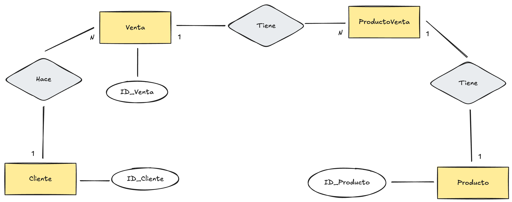

## Entidades

* Producto: representa a los articulos que vende la empresa.
* Clientes: representa a quienes compran muebles.
* Ventas: representa cada transacción individual realizada.
* ProductosVenta: la relación entre una venta y los productos que esta contiene.

## Atributos

* Cliente: ID, Nombre, Apellido, Dirección, Telefono, Email, DNI.
* Productos: ID, Nombre, Descripción, Precio, Stock, Categoria (Podría haber una tabla categorias)
* Ventas: ID, Fecha, ID_Cliente, Precio total.
* ProductosVenta: ID_Venta, ID_Producto, Cantidad, Precio unitario producto en ese momento (Los precios del en la tabla Producto pueden variar).

## Relaciones

* 1 Cliente ---- N Ventas
* 1 Venta ------ 1 o N ProductosVenta
* 1 Producto --- N ProductosVenta

## DER

