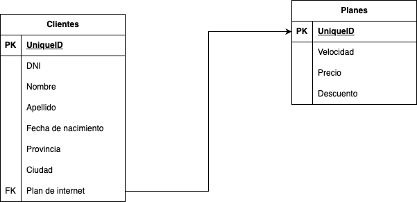

# DER

## Ejercicio 2 - Preguntas

1. La primary key de la tabla clientes puede ser un ID propio creado por nosotros. También podriamos usar su DNI pero no es lo ideal, como vimos en clase, no en todo el mundo este identificador es único.

2. El ID de plan, es lo ideal para poder usarlo como FK en la tabla de clientes.

3. Para cada cliente, se le asigna un ID que corresponde con el plan que posee, ese ID es la PK de la tabla de planes.

## Ejercio 4

1. Ver todos los planes de internet: SELECT * FROM Planes_Internet;
2. Ver todos los clientes nacidos despues de cierto año: SELECT nombre, apellido FROM Clientes WHERE fecha_nacimiento > '1990-12-31';
3. Ver todos los planes de mas de 200 megas: SELECT * FROM Planes_Internet WHERE velocidad_mbps > 200;
4. Ver cantidad de clientes por provincia: 
    SELECT provincia, COUNT(*) AS total_clientes
    FROM Clientes
    GROUP BY provincia;
5. Ver los clientes con determinado plan contratado
    SELECT dni, nombre, apellido
    FROM Clientes
    WHERE id_plan_contratado = 1;

